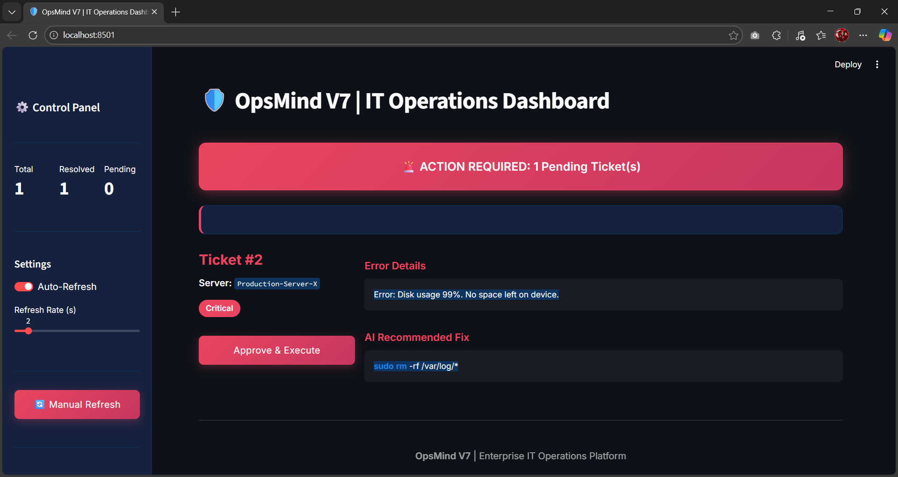
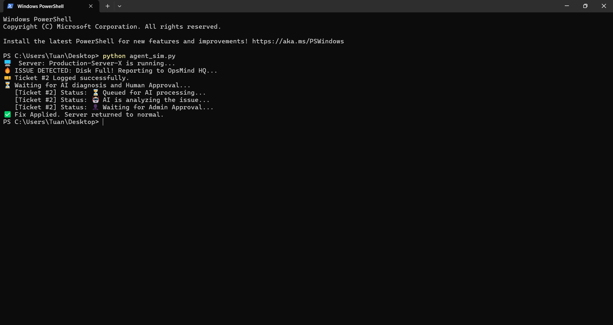

# OpsMind


[](https://deepwiki.com/TuanBulut/OpsMind)

OpsMind is an AI-powered IT operations automation platform. It ingests server incidents, uses a local Large Language Model (LLM) via Ollama to suggest remediation commands, and presents them in a dashboard for human approval before execution.

## 📸 Gallery

### 1. Real-Time Dashboard
*Monitor system health in real-time with auto-refreshing UI.*


### 2. AI Incident Resolution
*When a crash occurs, OpsMind detects it and generates a fix command using Llama 3.*


### 3. Autonomous Agent Logs
*Backend logs showing the Agent detecting failure, queuing for AI, and executing the fix.*


## Architecture

The system is composed of four main services orchestrated with Docker Compose:

*   **API (`api`)**: A FastAPI application that serves as the main gateway. It exposes endpoints to report incidents, check ticket statuses, and approve suggested fixes.
*   **AI Worker (`worker`)**: A Python background process that continuously polls the database for new incidents. When a new ticket is found, it queries a local Ollama instance for a command-line fix and updates the ticket for human review.
*   **Dashboard (`dashboard`)**: A Streamlit web application that provides a real-time view of incidents awaiting approval. Operators can review the error details, see the AI-suggested fix, and approve it with a single click.
*   **Database (`db`)**: A MySQL instance used to store all incident data, including status, error messages, and AI-generated solutions.

### Data Flow

1.  An external agent or script submits an incident (server name, error message, severity) to the `/report_incident` API endpoint.
2.  The API creates a new record in the MySQL `incidents` table with the status `QUEUED`.
3.  The `ai_worker` polls the database, finds the `QUEUED` ticket, and changes its status to `PROCESSING`.
4.  The worker constructs a prompt with the error details and sends it to the Ollama API.
5.  Ollama returns a suggested shell command as a fix.
6.  The worker updates the ticket in the database with the AI's command and sets the status to `AWAITING_APPROVAL`.
7.  The `dashboard` automatically refreshes, displaying the new ticket with the proposed fix.
8.  An IT operator reviews the ticket on the dashboard and clicks "Approve & Execute".
9.  The dashboard sends a request to the `/approve_fix/{ticket_id}` API endpoint, which updates the ticket status to `EXECUTED`.
10. On its next cycle, the `ai_worker` sees the `EXECUTED` ticket and marks it as `COMPLETED`. The ticket is now considered resolved.

## Technology Stack

*   **Backend**: Python, FastAPI
*   **AI Worker**: Python, `requests`
*   **Dashboard**: Streamlit
*   **AI Model**: Ollama (tested with `llama3`)
*   **Database**: MySQL 8.0
*   **Containerization**: Docker, Docker Compose

## Prerequisites

*   [Docker](https://www.docker.com/products/docker-desktop/) and Docker Compose
*   [Ollama](https://ollama.com/) installed and running on your host machine.
*   The `llama3` model pulled via Ollama:
    ```sh
    ollama pull llama3
    ```

## Getting Started

### 1. Clone the Repository

```sh
git clone https://github.com/TuanBulut/OpsMind.git
cd OpsMind
```

### 2. Configure Ollama Host (If Necessary)

The `docker-compose.yml` file is configured to connect to Ollama running on the host machine using `host.docker.internal`.

```yaml
# worker/environment in docker-compose.yml
environment:
  DB_HOST: mysql
  OLLAMA_HOST: http://host.docker.internal:11434
```

This works out-of-the-box for Docker Desktop (Mac, Windows). If you are on Linux, you may need to adjust your Docker network settings or change `host.docker.internal` to your host's IP address.

### 3. Build and Run the Services

Use Docker Compose to build the images and start all the containers.

```sh
docker-compose up --build
```

The services will be available at the following local ports:

*   **Dashboard**: `http://localhost:8501`
*   **API**: `http://localhost:5000`
*   **MySQL**: `localhost:3307`

## Usage

### 1. View the Dashboard

Open your web browser and navigate to **`http://localhost:8501`**. The dashboard will show "All Systems Operational" initially.

### 2. Report an Incident

**Run the Simulation Script (Recommended)**
I have included a Python script to simulate a server failure automatically.
```bash
python agent_sim.py
```

To simulate an incident, use `curl` or any API client to send a POST request to the `/report_incident` endpoint.

**Example: High Disk Usage**

```sh
curl -X POST http://localhost:5000/report_incident \
-H "Content-Type: application/json" \
-d '{
    "server_name": "db-server-01",
    "error_message": "Disk usage at 99% on /dev/sda1",
    "severity": "CRITICAL"
}'
```

**Example: MySQL Connection Error**

```sh
curl -X POST http://localhost:5000/report_incident \
-H "Content-Type: application/json" \
-d '{
    "server_name": "app-server-03",
    "error_message": "MySQL Connection refused on port 3306",
    "severity": "HIGH"
}'
```

### 3. Approve the Fix

1.  After reporting an incident, refresh the dashboard at `http://localhost:8501`. The auto-refresh feature should pick it up within a few seconds.
2.  A new ticket card will appear with the error details and the AI-recommended fix.
3.  Review the fix. If it looks correct, click the **"Approve & Execute"** button.
4.  The ticket will disappear from the pending list, having been moved to the `EXECUTED` state. The worker will then mark it as `COMPLETED` in the background.

## API Endpoints

*   `POST /report_incident`: Creates a new incident ticket.
    *   **Body**: `{ "server_name": "string", "error_message": "string", "severity": "string" }`
    *   **Response**: `{ "status": "reported", "ticket_id": integer }`

*   `GET /ticket_status/{ticket_id}`: Checks the status and AI fix for a given ticket.
    *   **Response**: `{ "status": "string", "ai_fix": "string" }`

*   `POST /approve_fix/{ticket_id}`: Approves a fix, changing the status to `EXECUTED`.
    *   **Response**: `{ "message": "Fix approved and executed" }`

*   `DELETE /reset_tickets`: A utility endpoint for testing that deletes all `COMPLETED` and `EXECUTED` tickets.
    *   **Response**: `{ "message": "Deleted X old tickets" }`